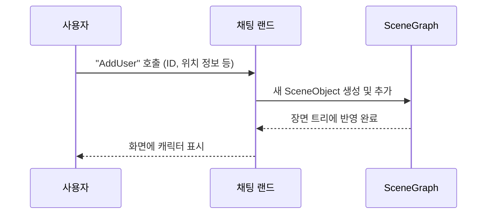

# Chapter 1: 채팅 랜드


이 장에서는 “채팅 랜드”라는 공간이 어떤 문제를 해결하고, 어떻게 작동하는지 간단한 예시와 함께 알아봅니다. “채팅 랜드”는 여러 사용자가 간단한 ‘게임 월드’처럼 하나의 가상 무대에서 함께 걸어 다니고, 채팅을 주고받으며, 서로의 상태를 실시간으로 공유할 수 있도록 해주는 핵심적인 기능입니다. 예를 들어, 온라인 가상 놀이공원에 여러 친구가 동시에 접속해 각자의 캐릭터를 움직이면서 수다 떨 수 있다고 상상해 보세요. 바로 그런 장면을 가능하게 해주는 것이 “채팅 랜드”입니다.

---

## 주요 개념 미리보기

“채팅 랜드”를 이해하기 위해서는 다음과 같은 간단한 개념들이 중요합니다:

1. **SceneContext**  
   화면을 그리거나 업데이트하는 공통 기반입니다. “채팅 랜드”는 내부적으로 [씬 컨텍스트](02_씬_컨텍스트_.md)라는 기능을 상속받아 사용합니다.

2. **SceneObject와 Component**  
   게임 속 객체(캐릭터, 배경, UI 등)를 구성하는 최소 단위입니다. 각각의 객체(SceneObject)마다 움직임·그래픽·상태를 담당하는 여러 컴포넌트(Component)가 들어갑니다.

3. **SceneGraph**  
   여러 SceneObject를 트리 구조로 묶어 관리합니다. 예를 들어, “채팅 랜드”의 가장 상위 루트 아래에 배경, 캐릭터, 채팅 창 등이 계층적으로 배치됩니다.

4. **ChatField**  
   채팅 입력과 관련된 부분입니다. 예를 들어, 사용자가 화면 어디를 클릭했는지, 어떤 채팅을 입력했는지를 담당합니다.

위 개념들은 차후에 좀 더 자세히 다룰 예정이지만, 일단은 “채팅 랜드”가 이 모든 요소를 종합해 “가상의 채팅 놀이터”를 구성한다는 점만 기억해 주세요.

---

## 간단한 예시: 사용자 추가하기

“채팅 랜드”는 여러 사용자가 동시에 접속할 수 있는 구조를 제공합니다. 예를 들어 “주인공 캐릭터를 화면에 추가”하고 싶다면 어떤 점이 필요할까요?

1. 사용자(또는 봇) ID, 이름, 위치 정보를 서버에서 전달받습니다.  
2. “채팅 랜드”는 이 정보를 이용해 캐릭터를 생성하고, 화면에 표시합니다.
3. 새로 추가된 캐릭터를 다른 모든 사용자도 실시간으로 볼 수 있게 허브(채팅 허브)를 통해 공유합니다.

아래는 “채팅 랜드” 내부에서 사용자를 추가하는 간단한 코드 일부입니다(설명을 위해 짧게 줄였습니다).

```csharp
public void AddUser(string id, string name, double posx, double posy, bool isMe)
{
    // 사용자 ID 중복 체크
    if (_isInitUser.ContainsKey(id)) return;

    // 사용자 객체 생성
    var characterObj = new SceneObject();
    var transform = new TransformComponent(characterObj);
    transform.Local.Position.X = (float)posx;
    transform.Local.Position.Y = (float)posy;
    characterObj.Components.Add(transform);

    // 캐릭터 정보 등록
    var character = new Character(isMe, id, name);
    characterObj.Components.Add(character);

    // 장면에 추가
    _sceneGraph.Root.AddChild(characterObj);
    _isInitUser[id] = true;
}
```

위 코드에서는 먼저 `_isInitUser`라는 Dictionary 구조를 이용해 이미 추가된 사용자인지 확인합니다. 그리고 `SceneObject`를 만들고, 여기에 `TransformComponent`(위치 정보)와 `Character`(사용자 상태 관리)를 붙여 준 뒤, 최종적으로 `_sceneGraph.Root`에 붙입니다. 이렇게 하면 화면에 새 캐릭터가 그려집니다.

---

## 실제 동작 과정: 한눈에 보기

사용자가 접속하거나 움직일 때 어떤 과정을 거치는지, 간단한 시퀀스 다이어그램으로 살펴봅시다.



- **사용자(U)** 가 접속하면 **채팅 랜드(CL)** 의 `AddUser`를 호출합니다.  
- **채팅 랜드(CL)** 는 내부 **SceneGraph(SG)** 를 업데이트하여 사용자 캐릭터 객체를 추가합니다.  
- 최종적으로 **채팅 랜드(CL)** 는 캐릭터가 화면에 나타나도록 렌더를 지시하고, 사용자는 이를 볼 수 있게 됩니다.

---

## 내부 구현 들여다보기

### ChatLand.cs 주요 흐름

아래는 ChatLand 클래스의 기본 골격입니다. 실제 코드 전체는 더 복잡하지만, 핵심 아이디어만 잘 이해하면 됩니다.

```csharp
public class ChatLand : SceneContext
{
    private SceneGraph _sceneGraph;
    private Dictionary<string,bool> _isInitUser;

    public ChatLand(Canvas2DContext context)
    {
        _sceneGraph = new SceneGraph();
        _isInitUser = new Dictionary<string, bool>();
    }

    protected override async ValueTask Update()
    {
        // 매 프레임마다 SceneGraph 업데이트
        await _sceneGraph.Update(this);
    }

    protected override async ValueTask Render()
    {
        // 매 프레임마다 화면에 그리기
    }
}
```

1. `ChatLand`는 [씬 컨텍스트](02_씬_컨텍스트_.md)를 상속받아, `Update`와 `Render` 메서드를 주기적으로 호출합니다.  
2. `SceneGraph` 객체 `_sceneGraph`가 실제로 장면의 모든 객체를 관리하며, `Update()`나 `Render()`가 실행될 때마다 각 객체의 상태를 갱신 및 그려 줍니다.  
3. `_isInitUser`는 서버에서 받은 사용자 ID를 추적하여 이미 추가된 사용자인지 확인하는 용도로 사용합니다.

### 중요한 메서드: AddUser

조금 더 살을 붙여 보면, 실제 `AddUser`에서는 캐릭터 애니메이션 초기화, 역할(Role) 부여, 자원(Resource) 할당 등 다양한 로직이 포함됩니다. 하지만 초심자분들은 “사용자마다 SceneObject를 하나씩 만들고, 컴포넌트(움직임, 그림, 정보)를 붙인 뒤, SceneGraph에 넣는다”고 이해하시면 충분합니다.

---

## 마무리 및 다음 장 소개

이번 장에서는 “채팅 랜드”가 여러 사용자가 동시에 활동할 수 있는 가상의 무대를 만들어 주는 핵심 구조라는 점을 배웠습니다. 한 문장으로 요약하면, “채팅 랜드”는 [씬 그래프](03_씬_그래프_.md), [캐릭터](04_캐릭터_.md) 등의 기능을 이용해 사용자의 움직임과 채팅을 통합적으로 관리하여, 다 함께 놀 수 있는 장면을 만들어 준다는 것입니다.

다음 장인 [씬 컨텍스트](02_씬_컨텍스트_.md)에서는 “채팅 랜드”가 상속받고 있는 SceneContext의 역할과, 실제로 매 프레임마다 어떻게 화면이 업데이트되는지 더욱 자세히 알아보겠습니다. 기대해 주세요!

---

Generated by [AI Codebase Knowledge Builder](https://github.com/The-Pocket/Tutorial-Codebase-Knowledge)