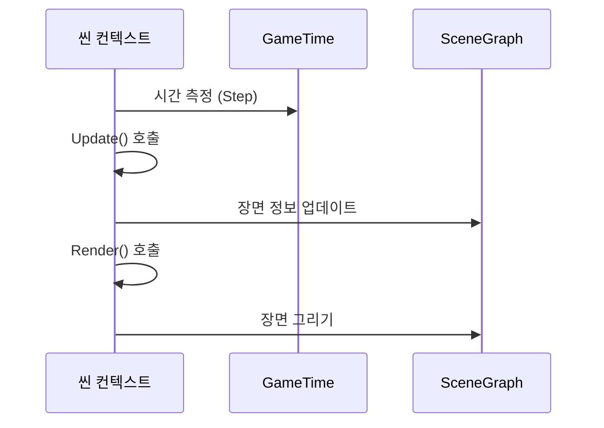

# Chapter 2: 씬 컨텍스트

앞 장인 [채팅 랜드](01_채팅_랜드_.md)에서 가상의 놀이터를 어떻게 구성하고, 여러 사용자가 동시에 들어와 움직이고 대화할 수 있는지를 살펴보았습니다. 이번 장에서는 그 기본이 되는 “씬 컨텍스트(SceneContext)”가 무엇이며, 왜 필요한지 알아보겠습니다.

---

## 왜 씬 컨텍스트인가?

게임이나 시각적인 시뮬레이션을 만들 때, 화면을 1초에 여러 번 그려주고(렌더), 각 객체의 상태를 계속 갱신해줘야 합니다(업데이트). 이를 정교하게 반복하면서도 매 끄럽게 운영하려면 “어디에서, 언제, 어떻게 화면을 그리는지”와 “어떻게 각 객체의 로직을 실행하고 시간 정보를 관리할 것인지”를 한 곳에서 총괄해주는 구조가 필요합니다. 바로 그 역할을 씬 컨텍스트가 맡습니다.

- 씬 컨텍스트는 매 프레임마다 “업데이트 → 렌더” 과정을 일정하게 유지합니다.  
- 씬 컨텍스트는 시간을 담당하는 `GameTime`을 통해 현재 프레임까지 걸린 시간, 경과한 시간을 추적합니다.  
- 최종적으로, 씬 컨텍스트가 있어야 모든 장면이 일관성 있게 움직이고, 화면에 그려집니다.

---

## 핵심 개념 한눈에 보기

씬 컨텍스트를 이해할 때 가장 중요한 개념은 다음과 같습니다:

1. **프레임 루프**  
   - 화면을 계속 새로 그리는(렌더링) 동시에, 게임 로직을 업데이트하는 과정을 프레임 루프라고 부릅니다.  
   - 씬 컨텍스트가 이 루프의 “시작점”이 되어, 모든 흐름을 제어합니다.

2. **GameTime**  
   - 씬 컨텍스트에 포함된 `GameTime`은 매 프레임마다 “지난 프레임 대비 경과한 시간”을 계산합니다.  
   - 달리기 애니메이션, 이동 속도 등 모두 시간이 중요한 요소인데, `GameTime`을 사용해 정확한 효과를 낼 수 있습니다.

3. **Display**  
   - 씬 컨텍스트 내부에는 `Display`라는 객체도 있으며, 화면 크기나 디스플레이 관련 정보를 담습니다.  
   - 예를 들어, 창 크기가 변경되면 씬 컨텍스트 내에서 이를 추적하고, 적절히 렌더링 비율을 조정할 수 있습니다.

---

## 간단 예시: 기본 구조 살펴보기

아래 예시는 씬 컨텍스트를 상속받아 새 클래스를 만드는 매우 간단한 코드입니다. 어떻게 `Update`와 `Render`가 계속 호출되는지 확인해 보세요.

```csharp
public class MySceneContext : SceneContext
{
    protected override async ValueTask Update()
    {
        // 매 프레임마다 게임 로직 실행
        // 예) 캐릭터 이동, 충돌 체크 등
    }

    protected override async ValueTask Render()
    {
        // 매 프레임마다 화면 그리기
        // 예) Canvas에 캐릭터, 배경 등을 표현
    }
}
```

위 코드에서는 `SceneContext`를 상속받을 때 두 가지 핵심 메서드, `Update`와 `Render`를 반드시 구현(override)해야 합니다. 이렇게 만들어진 `MySceneContext`는 스스로 매 프레임마다 `Update → Render` 흐름을 관리하게 됩니다.

---

## 씬 컨텍스트가 동작하는 과정

씬 컨텍스트의 내부 동작을 간단한 시퀀스 다이어그램으로 표현해 봅시다.



1. 씬 컨텍스트가 (SC) `GameTime`(GT)을 통해 시간 정보를 갱신합니다.  
2. 그 다음 `Update()` 메서드를 호출해 게임 로직(캐릭터 이동, 상태 변경 등)을 한 번씩 처리합니다.  
3. `SceneGraph`(SR) 등 내부 구조에 변화가 있다면 갱신을 마친 뒤,  
4. `Render()`를 호출해 최종적으로 화면을 그립니다.

---

## 내부 구현 엿보기

아래는 `SceneContext.cs` 파일의 핵심 부분 예시입니다. 실제 프로젝트에서는 비동기로 여러 기능을 추가적으로 다루지만, 여기서는 가장 간단한 흐름만 살펴봅시다.

```csharp
public abstract class SceneContext
{
    private bool _isFirst = true;

    public async ValueTask Step()
    {
        if (_isFirst)
        {
            this.GameTime.Start();
            _isFirst = false;
        }
        
        this.GameTime.Step();
        await Update();
        await Render();
    }

    protected abstract ValueTask Update();
    protected abstract ValueTask Render();

    public GameTime GameTime { get; } = new GameTime();
    public Display Display { get; } = new Display();
}
```

- `Step()` 메서드는 매 프레임마다 호출되며, 처음 한 번은 `GameTime.Start()`를 통해 기준 시간을 설정합니다.  
- `GameTime.Step()`을 통해 “이번 프레임이 시작되기까지 걸린 시간”을 저장하고, 그 뒤 `Update()` → `Render()` 순서대로 실행합니다.  
- `GameTime`과 `Display`는 씬 컨텍스트에서 바로 접근할 수 있는 공개 프로퍼티입니다.

### 간단 정리

- **Step()**: 매 프레임마다 불려 전체 흐름을 제어  
- **Update()**: 게임/시뮬레이션 로직 처리  
- **Render()**: 화면에 직접적인 그리기 작업 수행  
- **GameTime**: 경과 시간, 현재 시간을 추적  
- **Display**: 디스플레이 정보(해상도, 크기 등) 관리  

---

## 씬 컨텍스트 사용 예시

이제 씬 컨텍스트를 활용해 간단히 “한 객체를 화면에서 움직이기”를 구현한다고 가정해 봅시다. 예를 들어, 캐릭터가 왼쪽에서 오른쪽으로 일정 속도로 이동하는 코드는 아래처럼 작성할 수 있습니다.

```csharp
public class MovingScene : SceneContext
{
    private float _xPos = 0;

    protected override async ValueTask Update()
    {
        // 시간 기반으로 이동량 계산
        float deltaTime = (float)this.GameTime.ElapsedSeconds;
        _xPos += 100f * deltaTime; // 초당 100만큼 오른쪽 이동
    }

    protected override async ValueTask Render()
    {
        // 실제 Canvas에 그리는 로직 (예: 2D 도형 표시)
        // 가령 (xPos, 100) 위치에 사각형을 그린다고 가정
        // Canvas2DContext.DrawRect(_xPos, 100, 50, 50);
    }
}
```

- `deltaTime`은 “이전 프레임에서 이번 프레임까지 흐른 시간”입니다.  
- 매 초당 100만큼 이동하도록 설정하면, deltaTime(초 단위)을 곱해 위치를 변경합니다.  
- 한 프레임마다 수치가 갱신되고, `Render()`에서 이를 이용해 실제 화면에 사각형(혹은 캐릭터)을 찍어줍니다.

---

## 요약 및 다음 장

씬 컨텍스트(SceneContext)는 매 프레임마다 일관된 순서(업데이트 → 렌더)를 유지하고 시간을 추적해주는 중요한 기반입니다. 이를 통해 복잡한 게임이나 시뮬레이션이라도 한 틀 안에서 매끄럽게 동작할 수 있게 됩니다. 다음 장인 [씬 그래프](03_씬_그래프_.md)에서는 씬 컨텍스트 안에서 여러 객체를 계층 구조로 관리하는 방식을 좀 더 구체적으로 살펴보겠습니다.  

---

Generated by [AI Codebase Knowledge Builder](https://github.com/The-Pocket/Tutorial-Codebase-Knowledge)