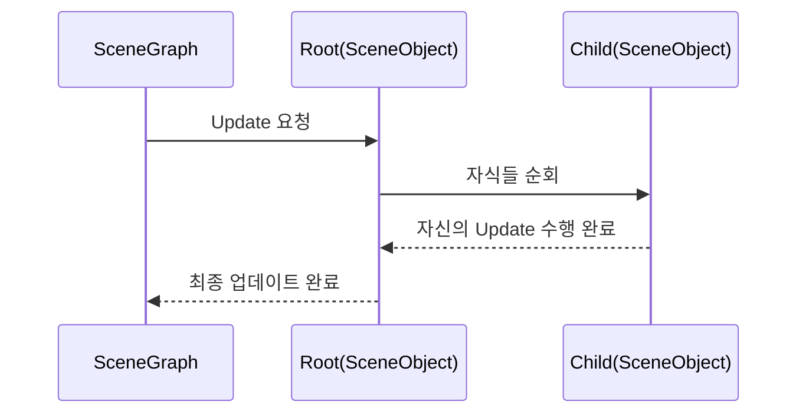

# Chapter 3: 씬 그래프

이전 장인 [씬 컨텍스트](02_씬_컨텍스트_.md)에서 “매 프레임마다 일관된 순서로 업데이트하고 렌더링을 수행하는 구조”가 왜 중요한지 살펴보았습니다. 이번에는 그 흐름 속에서 여러 오브젝트(캐릭터, 배경, 소품 등)를 트리 형태로 체계적으로 관리해 주는 “씬 그래프”를 배워보겠습니다. 씬 그래프를 활용하면, 복잡하게 뒤섞여 있는 오브젝트도 간편하게 추가·삭제·이동할 수 있고, 부모-자식 관계를 통해 상태(위치, 회전 등)를 일괄적으로 전파할 수 있습니다.

---

## 씬 그래프란 무엇인가?

“씬 그래프(SceneGraph)”는 장면(Scene)에 등장하는 모든 오브젝트를 트리(Tree) 구조로 배치하는 시스템입니다. 쉽게 말해, 아래 그림처럼 루트(Root) 노드가 있고, 그 아래에 여러 자식 노드가 붙어 있으며, 각 자식 노드도 다시 그 아래 자식들을 가질 수 있습니다.

- 부모-자식 관계로 묶임.  
- 부모를 이동하면 자식도 함께 이동.  
- 트리를 한 번 순회하면 모든 오브젝트를 자연스럽게 업데이트·렌더링.

예를 들어, 무대 위(루트)가 있고, 무대 위에 캐릭터와 소품들이 놓인다고 상상해 보세요. 캐릭터는 또 그 아래에 “머리 장식”이나 “무기” 같은 하위 소품을 달 수 있습니다. 이 계층을 그대로 코드에서 표현하는 것이 씬 그래프입니다.

---

## 언제 유용한가?

- 대규모 씬 관리: 수많은 오브젝트가 있을 때 트리 구조로 효율적으로 묶을 수 있습니다.  
- 애니메이션이나 움직임: 부모 위치를 옮기면 자식이 자동으로 따라옴. 캐릭터와 장비, 캐릭터와 그림자 같은 관계를 구현하기 쉽습니다.  
- 간단한 업데이트·렌더링 루프: 씬 그래프의 루트부터 자식들을 순회하면서 한 번에 모든 오브젝트를 처리할 수 있어 코드가 깔끔해집니다.

---

## 핵심 개념 살펴보기

씬 그래프를 처음 접하는 분들을 위해, 꼭 알아두면 좋은 핵심 개념들을 정리해 봅시다.

1. **루트(Root) 노드**  
   - 씬 그래프의 최상위 노드입니다. 보통 씬 그래프를 생성하면 `Root`라는 오브젝트가 자동으로 하나 생깁니다.  
   - 모든 오브젝트는 결국 루트에 연결되어 있습니다.

2. **SceneObject**  
   - 씬 그래프에 달리는 실제 “노드”입니다. 캐릭터, 배경, 소품 등, 씬에 등장하는 모든 것은 SceneObject가 됩니다.  
   - 위치, 회전, 크기 등을 관리하는 Transform 컴포넌트와, 그 밖의 기능(그래픽, 충돌, AI 등)을 담당하는 다양한 컴포넌트를 가질 수 있습니다.

3. **AddChild**, **RemoveChild**  
   - 부모-자식 관계를 맺을 때 사용합니다. 예: “검” 객체를 “플레이어” 객체의 자식으로 붙이면, 플레이어가 움직임에 따라 검도 함께 움직입니다.  
   - 계층 구조가 바뀌어야 할 때는 해당 메서드들을 써서 노드 간 관계를 변경할 수 있습니다.

4. **업데이트(Update)와 렌더(Render)**  
   - 씬 그래프는 루트부터 자식들을 DFS(Depth-First Search)처럼 순회하면서 각 노드의 업데이트와 렌더를 호출합니다.  
   - 한 번 순회하면 모든 자식들도 자연스럽게 처리됩니다.

---

## 간단 예시: 씬 그래프에 객체 추가하기

아래 코드는 씬 그래프에 “자식 노드”를 하나 만들어 붙여 보는 짧은 예시입니다. 이 예시에서는 씬 그래프를 `sceneGraph`라는 변수로 받아 두고, 새로운 SceneObject를 추가하는 과정을 살펴봅니다.

```csharp
// 새 오브젝트 생성
var childObject = new SceneObject();

// 씬 그래프의 루트에 자식으로 추가
sceneGraph.Root.AddChild(childObject);

/*
  이 시점에서 childObject는
  sceneGraph.Root의 자식이 됩니다.
  이후 업데이트나 렌더 시
  자동으로 childObject도 처리됩니다.
*/
```

- `var childObject = new SceneObject()`에서 새로운 노드를 만들고,  
- `sceneGraph.Root.AddChild(childObject)`로 루트에 붙이면 끝입니다.  
- 이제 이 `childObject`가 위치 등을 가지고 있다면, 씬 그래프가 매 프레임마다 알아서 업데이트·렌더링을 해 줍니다.

---

## 씬 그래프 동작 흐름

씬 그래프 내부 업데이트 과정을 단순화해 시퀀스 다이어그램으로 표현해 보겠습니다.



1. 씬 그래프(SceneGraph)가 “Root” 노드에게 “업데이트(Update)”를 요청합니다.  
2. 루트(Root)는 자신에게 달린 자식(SceneObject)들을 순서대로 호출합니다.  
3. 각 자식 노드는 자신이 가진 컴포넌트나 자식 노드를 다시 업데이트합니다.  
4. 업데이트가 모두 끝나면 씬 그래프는 다음 단계(렌더링 등)로 넘어갑니다.

---

## 실제 코드 속 씬 그래프 (간단 구현 예)

프로젝트 내부에서 씬 그래프를 간단히 살펴보면, 대략 아래와 같은 틀을 가지고 있습니다.

(중요 부분만 발췌하여 10줄 이내로 간소화)

```csharp
public class SceneGraph
{
    public SceneGraph()
    {
        Root = new SceneObject();
    }

    public async ValueTask Update(SceneContext game)
    {
        if (Root == null) return;
        await Root.Update(game);
    }

    public SceneObject Root { get; }
}
```

1. `SceneGraph`를 생성하면, 자동으로 `Root` 노드를 하나 생성합니다.  
2. `Update(SceneContext game)`가 호출되면, `Root.Update(game)`를 통해 루트와 모든 자식 SceneObject가 차례대로 업데이트됩니다.  
3. 그 결과, “부모가 먼저 업데이트되고, 자식이 그 뒤를 이어 업데이트”되는 계층적 구조가 자연스럽게 형성됩니다.

---

## 씬 그래프 사용 사례: “간이 무대” 만들기

실제로 어떻게 씬 그래프를 사용할 수 있는지, 작은 무대(Scene)를 구성하는 예시를 들어보겠습니다.  

예시 상황: “캐릭터가 서 있는 무대 위에, 조명(라이트) 오브젝트와 배경 오브젝트를 달고 싶다”라고 해 봅시다.

1) 무대용 SceneObject 생성  
2) 그 위에 “캐릭터” SceneObject와 “조명” SceneObject, “배경” SceneObject 등을 AddChild로 달기  
3) 씬 그래프 루트에 이 무대를 통째로 붙이기  

코드로 표현하면 대략 이렇게 됩니다:

```csharp
// (1) 무대용 오브젝트 생성
var stageObject = new SceneObject();

// (2) 각 오브젝트를 만들어 무대 오브젝트에 붙임
stageObject.AddChild(new SceneObject()); // 캐릭터 노드
stageObject.AddChild(new SceneObject()); // 조명 노드
stageObject.AddChild(new SceneObject()); // 배경 노드

// (3) 씬 그래프 루트에 이 무대를 통째로 붙임
sceneGraph.Root.AddChild(stageObject);
```

이제 업데이트 시에는 `stageObject` -> 캐릭터, 조명, 배경 순서로 자동 업데이트가 돌고, 렌더 시에도 동일하게 처리됩니다.

---

## 한 걸음 더: 트랜스폼(Transform)과 연계

씬 그래프에서는 “부모”가 움직이면 “자식”은 자동으로 그 움직임을 이어받습니다. 이 때 `Transform`이라는 컴포넌트가 중요한 역할을 합니다. 예를 들어, 부모 위치가 (100, 100)이고 자식 위치가 (20, 0)이면, 최종 월드 좌표는 (120, 100)이 됩니다. 이런 연산을 씬 그래프가 계층적으로 연결하여 계산해 주는 덕분에, 모든 자식의 위치를 개별적으로 수정하지 않아도 됩니다.

트랜스폼과 관련된 내용은 [트랜스폼 컴포넌트](06_트랜스폼_컴포넌트_.md)에서 자세히 다룰 예정이니, 여기서는 씬 그래프와 함께 “부모-자식 관계”의 힘을 발휘한다는 점만 기억해 주세요.

---

## 정리 및 다음 장

이 장에서는 “씬 그래프”가 무엇인지, 어떻게 트리 구조로 오브젝트들을 효율적으로 관리하는지를 살펴보았습니다.  

- 씬 그래프는 모든 오브젝트를 계층 구조로 묶어 업데이트와 렌더링을 한 번에 처리합니다.  
- 부모-자식 관계를 통해 위치, 회전 등 상태를 부모가 자식에게 전파합니다.  
- 대규모 장면도 손쉽게 관리할 수 있고, 간단한 코드로 트리 전체를 순회할 수 있습니다.

다음 장인 [캐릭터](04_캐릭터_.md)에서는 씬 그래프에 붙여질 구체적인 “캐릭터” 오브젝트를 어떻게 구성하고 움직이는지 알아보겠습니다. 실제로 씬 그래프와 트랜스폼을 활용하여 캐릭터가 화면에 나타나는 과정을 배워볼 테니, 기대해 주세요!

---

Generated by [AI Codebase Knowledge Builder](https://github.com/The-Pocket/Tutorial-Codebase-Knowledge)