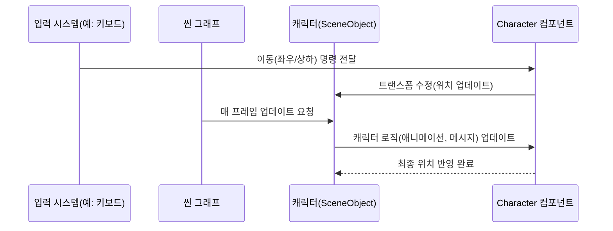

# Chapter 4: 캐릭터

이전 장인 [씬 그래프](03_씬_그래프_.md)에서 게임 속 오브젝트를 트리 구조로 효율적으로 관리하는 방법을 알아보았습니다. 이번 장에서는 그 씬 그래프에 붙여서 직접 움직이고 대화를 주고받는 주인공인 “캐릭터”에 대해 살펴봅니다. 게임이나 가상 공간에서 캐릭터는 가장 눈에 띄는 존재이자, 사용자의 입력을 받아 움직이거나 메시지를 표시하는 핵심적인 역할을 합니다.

---

## 왜 “캐릭터”가 중요한가?

가상의 세계에서 캐릭터는 마치 “연극 무대의 배우”처럼 행동하고, 대사(채팅 메시지)를 전달하며, 다른 등장인물과 소통하는 주체입니다. 특히 다음과 같은 점에서 캐릭터를 따로 분리해 두면 편리합니다:

1. 사용자 입력(키보드, 네트워크 정보 등)을 받아 이동 위치를 결정합니다.  
2. 이동에 따른 애니메이션(걷기, 달리기 등)을 실행합니다.  
3. 사용자마다 다를 수 있는 속성(이름, 역할-Role 등)을 관리합니다.  
4. “본인 캐릭터인지(isMine)” 여부에 따라 추가 제어 로직을 적용합니다(예: 키 입력 받기).

이 모든 것을 중앙에서 한 번에 처리하면 너무 복잡해지므로, “캐릭터”라는 독립된 구조를 둬서 정리하는 것이 훨씬 깔끔합니다.

---

## 간단 예시: 캐릭터 추가 및 이동

예를 들어, “내 캐릭터”를 씬 그래프에 하나 추가하고, 화살표 키 입력을 받아 움직이게 만들려면 어떤 과정을 거쳐야 할까요?

아래 코드는 매우 단순화된 예시입니다(설명용):

```csharp
// (1) 새 캐릭터 오브젝트 생성
var characterObj = new SceneObject();

// (2) 위치와 방향을 관리하는 트랜스폼 컴포넌트 추가
var transform = new TransformComponent(characterObj);
// 시작 위치 설정
transform.Local.Position.X = 100;
transform.Local.Position.Y = 100;
characterObj.Components.Add(transform);

// (3) 캐릭터 본체(이름, 역할 등 관리) 추가
var myCharacter = new Character(isMine: true, id: "User123", name: "Kim");
characterObj.Components.Add(myCharacter);

// (4) 씬 그래프 루트에 붙여 실제 장면에 등록
sceneGraph.Root.AddChild(characterObj);
```

위 과정을 통해 “캐릭터”가 씬 그래프에 정식으로 추가됩니다. 이제 씬 그래프의 업데이트가 돌 때마다 `Character` 컴포넌트 내부에 정의된 이동 로직을 자동으로 처리해 줍니다. 예를 들어, 키보드를 누르면 캐릭터가 걷는 애니메이션과 함께 좌우로 움직이도록 만들 수 있습니다.

---

## 캐릭터의 내부 구성 요소

캐릭터는 보통 다음과 같은 주요 요소를 갖습니다:

1. **TransformComponent(트랜스폼 컴포넌트)**  
   - 캐릭터의 “위치(Position), 방향(Direction), 회전(Rotation)” 등을 담당합니다.  
   - 부모-자식 관계를 형성하면, 캐릭터가 움직일 때 자식(무기, 소품)도 함께 따라다니게 됩니다.

2. **Character** (현재 챕터의 핵심 클래스)  
   - 캐릭터의 고유 정보(이름, 현재 채팅 메시지, isMine 등)를 가지고 있습니다.  
   - 키 입력이나 네트워크 메시지를 받아 이동을 처리하거나 채팅 메시지를 발행합니다.

3. **AnimationController와 RenderComponent**  
   - 캐릭터가 움직일 때 어떤 이미지를 보여줄지, 어떤 애니메이션을 재생할지 결정합니다(예: 걷기, 공격).  
   - 자세한 내용은 [애니메이션 컨트롤러](07_애니메이션_컨트롤러_.md)에서 다룹니다.

---

## 캐릭터 동작 과정 한눈에 보기

아래 시퀀스 다이어그램은 “캐릭터가 이동 메시지(또는 키 입력)를 받았을 때” 어떻게 반응하는지 간단하게 나타냅니다.



1. 입력 시스템(IS)이나 서버로부터 “이동” 명령이 들어오면, `Character` 컴포넌트가 이를 받습니다.  
2. 캐릭터 내부에서 위치를 관리하는 트랜스폼(Transform)을 수정합니다.  
3. 씬 그래프가 매 프레임마다 “CO”(`SceneObject`)에 업데이트를 호출하면, `Character`는 필요한 애니메이션이나 추가 로직을 실행합니다.  
4. 최종적으로 “CO”의 위치가 새롭게 반영되고, 화면에 그에 맞춰 표시됩니다.

---

## 내부 구현 예시 훑어보기

프로젝트 내에서는 “캐릭터” 로직을 좀 더 복잡하게 다루고 있습니다. 여기서는 중요한 부분 몇 줄만 발췌해 보겠습니다.

아래 코드는 “키 입력”으로 이동하는 간단 예시(실제 코드 일부 요약)입니다:

```csharp
// 키 입력 상태 확인 후 이동 처리
float speed = 0f;

if (rightKeyDown)
{
    _transform.Local.Direction = Vector2.UnitX;
    speed = 0.25f;
}

if (leftKeyDown)
{
    _transform.Local.Direction = -Vector2.UnitX;
    speed = 0.25f;
}

// 방향에 speed를 곱해 위치 업데이트
var deltaTime = game.GameTime.ElapsedMilliseconds;
var move = _transform.Local.Direction * speed * deltaTime;
_transform.Local.Position += move;
```

1. 먼저 왼쪽 키나 오른쪽 키가 눌렸는지 확인합니다.  
2. 눌린 키에 따라 방향(`_transform.Local.Direction`)을 정하고, 속도(`speed`)를 설정합니다.  
3. `deltaTime`(프레임 간 경과 시간)을 반영해 최종 이동 거리를 계산하고, 트랜스폼의 위치에 더해 줍니다.  

이 로직 자체는 간단해 보이지만, 실제로는 캐릭터가 가는 방향에 따라 거울 대칭(좌우 뒤집기) 처리나 애니메이션도 함께 조정해야 합니다.

---

## Queue를 통한 네트워크 이동 처리

로컬 키 입력 대신, 서버에서 “좌표 변경” 메시지를 받는 식으로 캐릭터 이동을 할 수도 있습니다. 예컨대 여러 사용자가 동시에 접속해 서로 움직일 때, “다른 플레이어” 캐릭터의 좌표가 큐(Queue)에 쌓일 수 있습니다. 캐릭터는 매 프레임마다 큐에서 한 개씩 꺼내 적용합니다.

아래 짧은 예시는 네트워크로부터 받은 이동 데이터를 큐에 저장했다가 한 번씩 꺼내 적용하는 구조(간단 요약)입니다:

```csharp
// 네트워크로 받은 이동 정보 저장
_queue.Enqueue(updateUserPos);

// 매 프레임마다 큐에서 꺼내 이동 반영
if(_queue.TryDequeue(out var moveData))
{
    // 목표 위치(_goal_transform) 설정
    // 실제(_transform.Local.Position)를 목표 위치에 가깝게 이동
}
```

이렇게 하면 “멀티플레이 상황”에서도 각 캐릭터가 자신의 위치 업데이트 메시지를 순차적으로 받아 자연스럽게 이동하는 흐름을 구현할 수 있습니다.

---

## 예시 코드 정리

실제 “Character” 클래스 내부에서는 다음과 같은 과정을 거칩니다:

1. 사용자(또는 네트워크)로부터 이동 입력을 받음(`OnMoveKey`, `OnMoveQueue` 등).  
2. `_transform.Local.Position`을 변경하거나, 목표(Goal) 위치를 정해 매 프레임 조금씩 이동.  
3. `Render` 메서드에서 닉네임이나 채팅 메시지를 화면에 표시(말풍선).  
4. “isMine” 여부에 따라 키 입력은 내 캐릭터만 받도록 설정.  

코드를 나누어 보면:

```csharp
public Character(bool isMine, string id, string name)
{
    // 내 캐릭터인지, ID와 이름 설정
    _isMine = isMine;
    Name = name;
    // ...
}

public void OnMoveKey(/*키 입력 정보*/)
{
    // 입력에 따라 _transform.Local.Direction 설정
    // speed 결정
}
```

(위 코드는 예시라 매우 간단히 표현했지만, 실제 프로젝트에서는 애니메이션, 리소스 관리 등의 항목을 추가로 처리합니다.)

---

## 마무리 및 다음 장 예고

이번 장에서는 “캐릭터”가 어떤 식으로 구성되고, 움직임이나 채팅 메시지를 어떻게 처리하는지 살펴보았습니다. 핵심 포인트는 다음과 같습니다:

- 캐릭터는 씬 그래프에서 “움직이는 배우” 역할을 담당하며, 입력(또는 네트워크 메시지)에 따라 트랜스폼을 변경합니다.  
- “isMine” 같은 속성을 통해 본인 캐릭터만 키 입력을 받아 이동시키거나, 네트워크로 받은 좌표를 적용해 “다른 사용자” 캐릭터를 움직일 수 있습니다.  
- 말풍선(채팅 메시지)이나 애니메이션 등은 캐릭터의 상태에 따라 함께 업데이트되고 그려집니다.

다음 장인 [입력 시스템](05_입력_시스템_.md)에서는 키보드나 마우스 입력을 어떻게 처리해서 캐릭터가 이동하곤 하는지, 좀 더 구체적인 방법을 알아보겠습니다. 기대해 주세요!

---

Generated by [AI Codebase Knowledge Builder](https://github.com/The-Pocket/Tutorial-Codebase-Knowledge)