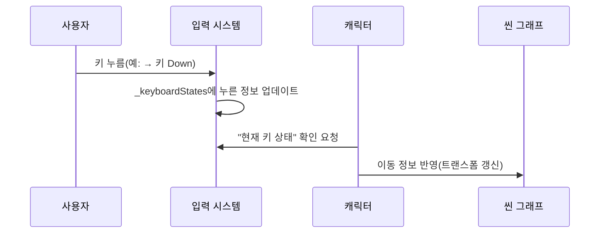

# Chapter 5: 입력 시스템

이전 장인 [캐릭터](04_캐릭터_.md)에서 “사용자 캐릭터가 어떻게 움직이고, 상태를 주고받는지”를 살펴보았습니다. 이제 그 움직임을 실제로 가능하게 만드는 구체적인 방법, 즉 키보드나 마우스 입력을 처리하는 “입력 시스템”에 대해 알아보겠습니다. 캐릭터가 어떻게 방향키를 통해 이동하고, 마우스 클릭 이벤트를 받아 어떤 동작을 할 수 있는지, 기초부터 차근차근 살펴보도록 하겠습니다.

---

## 입력 시스템이란 무엇인가?

간단히 말해, “입력 시스템”은 사용자가 누른 키나 클릭한 마우스 버튼 상태 등을 모아서 “지금 어떤 버튼이 눌렸는지”를 쉽게 조회할 수 있게 해주는 도구입니다.  

• 키보드 방향키(↑,↓,←,→)를 여러 개 동시 누름  
• 마우스 좌클릭, 우클릭, 드래그 위치 등  
• 스페이스바나 Ctrl, Alt 키 같은 특수 키  

모두를 일일이 감지해 **실시간**으로 저장하고, 게임(또는 앱) 로직이 “지금 어떤 키가 눌려 있나?”를 간편히 묻도록 해줍니다.

---

## 간단 예시: 캐릭터 이동

가장 대표적인 예시로, 방향키를 통해 캐릭터를 이동시키는 상황을 떠올려 봅시다. 사용자가 → 키(오른쪽)를 누르면 캐릭터가 오른쪽으로 조금씩 움직이고, 키를 떼면 멈춘다고 가정해 보겠습니다.  

입력 시스템이 없으면, 우리는 매 프레임마다 “이 키가 눌렸나?”를 직접 확인해야 합니다. 하지만 “입력 시스템”을 쓰면, 그저 “InputSystem.Instance.GetKeyState(Keys.Right).State”처럼 묻기만 하면 됩니다. 그러면 현재 누른 상태(Down)인지 혹은 떼진 상태(Up)인지 알 수 있습니다.

---

## 주요 개념

1. 싱글턴(Singleton) 접근  
   “입력 시스템”은 어디서든 접근 가능해야 하므로 보통 “싱글턴” 패턴을 사용합니다. 예: “InputSystem.Instance”  

2. 키 상태 추적(Dictionary 구조)  
   각 키(예: Keys.Left, Keys.Right 등)에 대해 “Down” 상태인지 “Up” 상태인지 저장해 둡니다.  

3. 마우스 버튼, 좌표 추적  
   마우스 왼버튼, 오른버튼 등도 키와 유사하게, “Down/Up” 상태를 기록하며, 현재 마우스 좌표도 저장해 둘 수 있습니다.  

4. 프레임 간 이전 상태 보존  
   “이전 프레임에는 누른 상태였고, 이번 프레임에는 떼진 상태” 등 비교 정보가 필요할 때, 해당 상태를 함께 관리합니다.  

---

## 간단 코드 미리보기 (InputSystem.cs)

프로젝트 내부 “BlazorChatApp\Client\Core\InputSystem.cs” 파일에 핵심 로직이 담겨 있습니다. 여기서는 코드를 9줄 이하로 나누어 주요 흐름만 짧게 확인해 봅시다.

아래는 “키 상태”를 저장하는 부분 일부를 보여주는 예시입니다:

```csharp
// InputSystem은 전역에서 단 하나만 존재
private static readonly Lazy<InputSystem> _instance
    = new Lazy<InputSystem>(new InputSystem());

public static InputSystem Instance => _instance.Value;

private readonly IDictionary<Keys, ButtonState> _keyboardStates;

// 생성자에서 모든 키를 초기화
private InputSystem()
{
    _keyboardStates = EnumUtils.GetAllValues<Keys>()
                        .ToDictionary(k => k, k => ButtonState.None);
}
```

1. “_instance”라는 `Lazy<InputSystem>`를 통해 싱글턴을 구현합니다.  
2. “_keyboardStates”라는 `Dictionary`가 “키값(Keys) → 현재상태(ButtonState)”를 저장합니다.  
3. 생성자에서는 “모든 Keys를 None 상태로” 초기화해 둡니다.

---

### 키 상태 등록 메서드 예시

이제 “키를 눌렀는지”를 갱신하는 실제 메서드도 짧게 살펴봅시다.

```csharp
public void SetKeyState(Keys key, ButtonState.States state)
{
    var oldState = _keyboardStates[key];
    _keyboardStates[key]
        = new ButtonState(state, oldState.State == ButtonState.States.Down);
}
```

• “SetKeyState”에 특정 키와 새로운 상태(Down/Up)를 전달하면, 내부 Dictionary(`_keyboardStates`)가 업데이트됩니다.  
• 기존 상태가 Down이었는지 아닌지도 함께 기록하여 “WasPressed” 같은 추가 정보도 유지합니다.

---

## 입력 흐름 한눈에 보기

아래 시퀀스 다이어그램은 “사용자 → 입력 시스템 → 캐릭터 → 씬 그래프” 식으로 입력이 전달되는 흐름의 단순 예시를 보여줍니다.



1. 사용자가 → 키를 누르면, “입력 시스템(IS)”은 `_keyboardStates`에 “Down” 상태로 저장합니다.  
2. 캐릭터(CH)는 매 프레임마다 “입력 시스템”에 “→ 키가 눌렸는가?”를 물어보고,  
3. 씬 그래프(SG)의 트랜스폼을 수정해 이동을 반영합니다.

---

## 실제 사용 예시: 캐릭터 이동 처리

이제 캐릭터 쪽 코드에서 “입력 시스템”을 어떻게 활용하는지 간단히 보겠습니다. 예를 들어, 나란 코드 블록을 상상해 봅시다:

```csharp
// 캐릭터 업데이트 로직 예시
bool rightDown 
    = InputSystem.Instance.GetKeyState(Keys.Right).State 
      == ButtonState.States.Down;

if (rightDown)
{
    _transform.Local.Position.X += 0.2f; // 살짝 오른쪽 이동
}
```

• “Keys.Right”가 “Down” 상태라면, 캐릭터의 X 좌표를 약간 증가시킵니다.  
• 이렇게 매 프레임마다 체크하면, 오른쪽 방향키를 누르고 있는 동안 캐릭터가 계속 오른쪽으로 움직입니다.

---

## 마우스 입력 처리

입력 시스템은 키보드뿐 아니라 마우스 버튼, 마우스 위치도 관리합니다. 예를 들어, “마우스 왼쪽 버튼이 눌렸는가?”를 물어보고, 클릭 위치를 기반으로 캐릭터 이동 목적지를 설정할 수도 있습니다.

```csharp
// 마우스 예시
var leftButton 
    = InputSystem.Instance.GetButtonState(MouseButtons.Left);

if (leftButton.State == ButtonState.States.Down)
{
    var mousePos = InputSystem.Instance.MouseCoords;
    // 마우스 좌표로 뭔가 실행
}
```

이처럼 “입력 시스템” 하나로 키보드와 마우스 모두 손쉽게 다룰 수 있습니다.

---

## 내부 동작 정리

정리하면, 입력 시스템은 매 프레임 또는 이벤트에서 호출되는 “SetKeyState / SetButtonState” 메서드를 통해 “현재 눌림 상태”를 업데이트합니다. 개발자는 “GetKeyState / GetButtonState” 같은 메서드를 이용해 그 결과를 읽어, 캐릭터 이동이나 버튼 클릭 로직을 작성하게 됩니다.

---

## 마무리 및 다음 장

이번 장에서는 “입력 시스템”이 무엇이고, 왜 중요한지, 그리고 어떻게 키보드·마우스 이벤트를 추적해 캐릭터나 게임 로직에서 쉽게 사용할 수 있도록 돕는지 배웠습니다.  
- 싱글턴을 통해 어디서든 한 번에 접근 가능  
- Dictionary 구조로 키/버튼별 Down/Up 상태 저장  
- 매 프레임마다 “GetKeyState” 등을 통해 쉽고 빠르게 입력 확인  

다음 장인 [트랜스폼 컴포넌트](06_트랜스폼_컴포넌트_.md)에서는 이렇게 입력된 이동 정보가 실제로 캐릭터의 위치(트랜스폼)에 어떻게 반영되는지 구체적으로 알아보겠습니다. 이를 통해 한층 더 생동감 있는 씬을 구현해 봅시다!  

---

Generated by [AI Codebase Knowledge Builder](https://github.com/The-Pocket/Tutorial-Codebase-Knowledge)