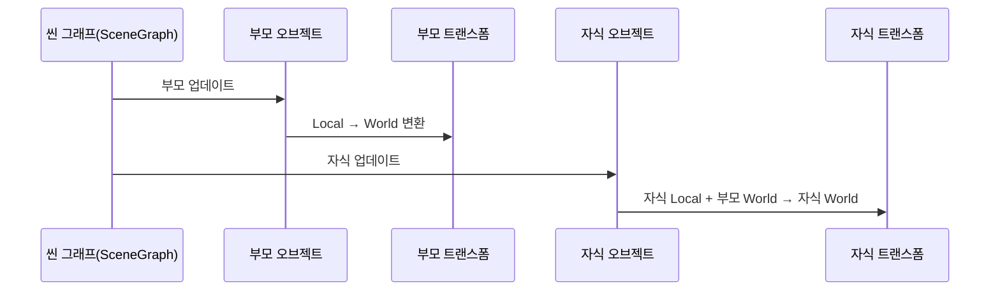

# Chapter 6: 트랜스폼 컴포넌트

이전 장인 [입력 시스템](05_입력_시스템_.md)에서 캐릭터가 어떻게 키 입력이나 마우스 입력을 받아 움직이는지 살펴보았습니다. 이제 그 움직임을 화면상에서 실제 위치로 적용할 때, “트랜스폼 컴포넌트”가 핵심 역할을 담당합니다. “트랜스폼 컴포넌트”는 오브젝트의 위치(Position), 회전(Rotation), 크기(Scale) 등을 관리하여, 마치 “오브젝트가 어디에 있고, 어떤 각도로 서 있으며, 얼마나 큰지”를 한눈에 알 수 있도록 돕습니다. 이 장에서는 그 기본 원리와 사용 방법을 단계별로 알아보겠습니다.

---

## 왜 트랜스폼 컴포넌트인가?

게임이나 그래픽 장면에서 오브젝트를 옮길 때는 “지역좌표(Local)”와 “월드좌표(World)”의 개념이 필요합니다. 예를 들어, 테이블(부모 오브젝트) 위에 놓인 컵(자식 오브젝트)이 있다고 생각해 봅시다.  
- 부모(테이블)의 위치가 바뀌면, 자식인 컵도 자연스럽게 따라가야 합니다.  
- “Local Position”은 테이블을 기준으로 한 컵의 좌표이고, “World Position”은 화면(또는 전체 월드)에서 본 컵의 좌표입니다.  

“트랜스폼 컴포넌트”는 이런 부모-자식 이동 관계를 자동으로 계산해 주어, 개발자가 손쉽게 “캐릭터를 이동시키거나” “소품을 캐릭터에 붙이거나” 하는 일을 관리할 수 있게 만듭니다.

---

## 트랜스폼 컴포넌트 핵심 개념

초보자분들이 꼭 기억하면 좋은 핵심 포인트는 다음과 같습니다:

1. Local vs World  
   - Local: 오너(부모) 기준 좌표(상대 위치)  
   - World: 씬 전체에서의 최종 좌표(절대 위치)

2. 부모-자식 관계 자동 계산  
   - 부모가 움직이면, 자식의 “Local” 위치에 부모의 “World” 위치가 더해져 최종 월드 좌표로 반영됩니다.  

3. 갱신 시점(Update)  
   - 매 프레임마다 “Local” 정보를 바탕으로, “World” 정보가 갱신됩니다.

---

## 간단 예시: 트랜스폼 컴포넌트 생성

먼저, 트랜스폼 컴포넌트를 사용하는 기본 예시를 살펴봅시다. 예를 들어, “SceneObject”에 붙은 “TransformComponent”를 만드는 코드입니다:

```csharp
// 1) 빈 SceneObject 생성
var myObject = new SceneObject();

// 2) 트랜스폼 컴포넌트 생성 후 장착
var transform = new TransformComponent(myObject);
myObject.Components.Add(transform);
```

1) `myObject`라는 오브젝트를 새로 만들고,  
2) `new TransformComponent(myObject)`를 통해 트랜스폼 컴포넌트를 생성해 `myObject`에 붙입니다.  

이제 `myObject`는 자신의 “Local.Position” 값에 따라 화면상에서 위치가 정해지게 됩니다.

---

## “Local” 좌표 수정하기

실제로 오브젝트를 움직이고 싶다면 어떻게 할까요? 아주 간단한 예는 아래와 같습니다:

```csharp
// myObject의 트랜스폼 컴포넌트를 가져온 뒤
// 위치 정보(Local.Position)를 조정
transform.Local.Position.X = 100f;
transform.Local.Position.Y = 50f;
```

- 이렇게 하면 “Local” 좌표가 (100, 50)으로 설정됩니다.  
- `Update` 단계에서 “World” 좌표도 (100, 50)으로 계산되어 반영됩니다(예: 부모가 없다면 Local이 그대로 World가 됩니다).

---

## 씬 그래프 업데이트 흐름에서의 트랜스폼

앞선 [씬 그래프](03_씬_그래프_.md) 장에서 “부모가 먼저 업데이트 → 자식 업데이트” 과정을 살펴본 적이 있습니다. 트랜스폼 컴포넌트도 이 흐름에 맞춰 작동합니다.  

아래 시퀀스 다이어그램은 “부모-자식이 있는 씬 오브젝트”가 업데이트되는 과정을 간략히 보여줍니다.



1. 씬 그래프가 부모 오브젝트(P)를 먼저 업데이트합니다.  
2. 부모 트랜스폼(PC)이 자기 Local 정보를 바탕으로 World 값을 계산합니다.  
3. 그 다음 자식 오브젝트(C)를 업데이트해,  
4. 자식 트랜스폼(CC)이 “자기 Local + 부모 World”를 합쳐 최종 World 값을 정합니다.

---

## 실제 코드 내부: TransformComponent.cs

프로젝트 “BlazorChatApp\Client\Core\Components\TransformComponent.cs”에서 트랜스폼 컴포넌트가 어떻게 구현되는지 요약본을 봅시다. (아래는 간단히 핵심 부분만 발췌해 9줄 내로 줄였습니다.)

```csharp
public class TransformComponent : BaseComponent
{
    private Transform _local = Transform.Identity();
    private readonly Transform _world = Transform.Identity();

    public override async ValueTask Update(SceneContext game)
    {
        _world.Clone(ref _local);
        if (Owner.Parent != null 
            && Owner.Parent.Components.TryGet<TransformComponent>(out var parentTrans))
        {
            _world.Position = _local.Position + parentTrans.World.Position;
        }
    }

    public Transform Local => _local;
    public Transform World => _world;
}
```

이 코드에서 확인할 수 있는 핵심 포인트는 다음과 같습니다:

1. `_local`과 `_world` 두 가지를 유지.  
2. `Update` 메서드에서 `Clone`을 통해 `_local` 값을 `_world`에 복사한 뒤, 부모(Parent)의 트랜스폼이 있을 경우 두 좌표를 합쳐 최종 `_world.Position`을 계산합니다.  
3. `Local`과 `World` 프로퍼티를 통해 외부에서 해당 정보를 읽을 수 있습니다.

---

## 예시: 부모가 (50, 0), 자식이 (10, 5)

트랜스폼 계산을 좀 더 구체적으로 살펴보겠습니다.

● 부모 “Local” 좌표가 (50, 0)  
● 자식 “Local” 좌표가 (10, 5)

만약 부모의 World 좌표가 (50, 0)이라고 하면, 자식의 World 좌표는 (부모World + 자식Local)이므로 (60, 5)가 됩니다.  
- 만약 부모가 (100, 100)으로 움직이면 → 자식은 자동으로 (110, 105)가 되어 따라갑니다.

이처럼 “트랜스폼 컴포넌트”는 오브젝트들의 계층적 이동을 간단히 처리해 줍니다.

---

## 트랜스폼과 회전·스케일

현재 예시 코드에서는 주로 Position만 다루었지만, 동일한 방식으로 회전(Rotation)이나 스케일(크기)도 처리할 수 있습니다. 예를 들어, 캐릭터가 45도 회전하면, 그 자식도 동일하거나 혹은 해당 각도를 기준으로 또 상대적 회전을 적용받을 수 있습니다.

만약 부모가 2배 크기로 스케일링하면, 자식도 전체적으로 2배 확대되어 보이는 식입니다.  
(이 프로젝트에서는 2D 좌표가 기본이라 회전이나 스케일 로직이 간단히 구현되어 있습니다.)

---

## 간단 사용 흐름 요약

트랜스폼 컴포넌트를 실제로 사용하는 과정을 초보자 시각에서 정리하면:

1) SceneObject를 생성한다.  
2) TransformComponent를 만들어 SceneObject에 붙인다. 최초 위치(또는 회전, 스케일)를 설정한다.  
3) 부모-자식 구조를 씬 그래프에 등록한다.  
4) 매 프레임마다 `Update`가 돌 때, Local → World 계산이 자동으로 적용된다.  
5) 오브젝트를 옮기거나 회전하고 싶으면 “Local” 값을 수정한다.  

---

## 예시 코드: 캐릭터 이동 + 트랜스폼

우리가 [입력 시스템](05_입력_시스템_.md)에서 “→ 키를 누르면 캐릭터 오른쪽 이동” 예시를 봤습니다. 그 로직을 트랜스폼과 연결해 보면, 대략 아래처럼 작성할 수 있습니다:

```csharp
// (1) 키 입력 체크
bool rightDown 
  = InputSystem.Instance.GetKeyState(Keys.Right).State
    == ButtonState.States.Down;

// (2) 트랜스폼 가져오기
var transform = characterObj.GetComponent<TransformComponent>();
if (transform == null) return;

// (3) 오른쪽 키가 눌렸으면 Local.Position.X를 조금 증가
if (rightDown)
{
    transform.Local.Position.X += 0.25f;
}
```

1) “→ 키”가 Down 상태인지 확인,  
2) 캐릭터의 TransformComponent를 가져옴,  
3) 눌림 상태라면 `Local.Position.X`를 조금씩 증가시켜 이동. (그러면 자동으로 World 좌표도 업데이트 시 반영됨)

---

## 요약 및 다음 장

이번 장에서는 오브젝트의 위치, 회전, 크기를 관리하는 “트랜스폼 컴포넌트”가 어떻게 동작하고, 씬 그래프 흐름과 함께 월드 좌표를 자동으로 계산해 주는지 알아보았습니다.  
- Local vs World를 사용하여 부모-자식 관계를 자연스럽게 구현  
- 매 프레임마다 “Update” 시점에 Local 정보 → World 정보로 업데이트  
- 오브젝트 이동, 회전, 크기 변경 시 정말 편리하게 쓸 수 있음  

다음 장인 [애니메이션 컨트롤러](07_애니메이션_컨트롤러_.md)에서는 이렇게 위치가 정해진 오브젝트에 “움직임(모션)”을 표현하는 방법을 조금 더 깊이 살펴보겠습니다. 캐릭터가 걷거나 뛰는 애니메이션을 어떻게 보여주는지 궁금하다면, 다음 장도 꼭 확인해 주세요!  

---

Generated by [AI Codebase Knowledge Builder](https://github.com/The-Pocket/Tutorial-Codebase-Knowledge)