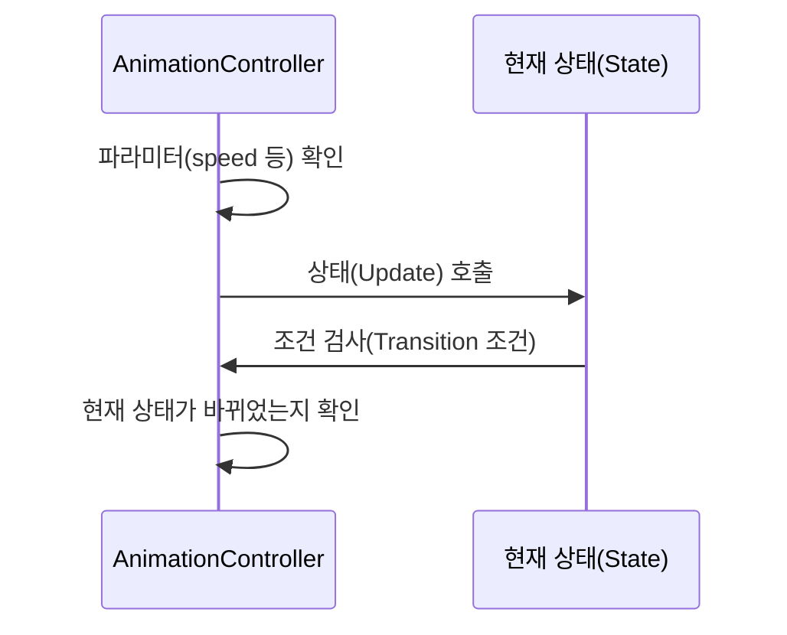

# Chapter 7: 애니메이션 컨트롤러

이전 장인 [트랜스폼 컴포넌트](06_트랜스폼_컴포넌트_.md)에서 캐릭터나 오브젝트가 화면상 어떤 위치에서 어떻게 움직이는지를 살펴보았습니다. 이번에는 그 움직임을 바탕으로 실제로 “걷는 모션”, “공격 모션” 등 다양한 애니메이션을 제어해 주는 “애니메이션 컨트롤러”를 알아보겠습니다.

“애니메이션 컨트롤러”는 간단히 말해, 캐릭터의 현재 상태(대기, 걷기, 공격 등)에 맞춰 어떤 애니메이션을 재생할지 결정해 주는 역할을 합니다. 예를 들어, 캐릭터 속도가 0보다 크면 “걷는 애니메이션”을 틀고, 공격 버튼이 눌렸으면 “공격 애니메이션”으로 전환하는 식입니다. 이 과정을 효율적으로 설계하면, 복잡한 애니메이션 로직을 한곳에서 간단히 해결할 수 있습니다.

---

## 왜 애니메이션 컨트롤러인가?

• 캐릭터가 일어서 있다가, 달리고, 또 공격하는 다양한 동작을 유연하게 전환하기 위해  
• 상태(또는 파라미터)에 따라 “어떤 애니메이션을 재생할지” 미리 정의해 두면 유지보수가 편해짐  
• 애니메이션이 변경될 때마다 복잡한 분기 코드를 직접 작성할 필요 없이, 상태 전이(Transition)만 추가하면 됨  

---

## 주요 개념 한눈에 보기

1. 상태(State)  
   - “Idle(대기), Walk(걷기), Attack(공격)”처럼 특정 애니메이션에 대응되는 상태를 말합니다.
2. 파라미터(Parameters)  
   - 속도(speed), 공격 여부(attacking) 같은 변수를 두고, 값 변화에 따라 다음 상태로 전환 여부를 결정합니다.
3. 전이(Transition)  
   - “speed > 0이면 Idle → Walk” 처럼, 어떤 조건을 만족할 때 상태를 바꾸는 규칙입니다.
4. 기본 상태(Default State)  
   - 처음에 아무것도 하지 않을 때 실행되는 초기 애니메이션(예: Idle).

---

## 간단 예시: “걷기”와 “대기” 전환

예시로, “speed” 파라미터를 기준으로 “Idle”에서 “Walk”로 전환해 보겠습니다.

1) “speed”라는 float 파라미터를 애니메이션 컨트롤러에 추가  
2) Idle 상태에서 “speed > 0.1”이면 Walk로 전환하도록 설정  
3) Walk 상태 업데이트 시 “speed == 0”이 되면 다시 Idle로 돌아오게 설정  

---

### 예시 코드 (간략화, 8줄 이하)

아래 코드는 매우 축약된 예로, “IdleState”에서 속도가 0보다 크면 “WalkState”로 전환하는 로직을 보여줍니다:

```csharp
var idleState = new AnimationState(idleAnim);
idleState.AddTransition(
    walkState,
    new[] { (AnimationController ac) => ac.GetFloat("speed") > 0f }
);
```

- “idleState”에서 `walkState`로 넘어가는 조건을 하나 등록합니다.  
- `ac.GetFloat("speed") > 0f`인 순간 상태가 전환됩니다.

---

## 내부 동작 흐름

아래 시퀀스 다이어그램은 애니메이션 컨트롤러가 상태 전환을 어떻게 처리하는지 간단히 나타냅니다.



1. “AnimationController(AC)”가 매 프레임 파라미터들을 확인  
2. 현재 상태(ST)의 Update를 호출해 “전이(Transition) 조건”을 검사  
3. 조건을 만족하면 “AC”가 다른 상태로 전환  

---

## 어떻게 사용하나? (초간단 순서)

1. “AnimationController” 컴포넌트를 씬 오브젝트(캐릭터 같은)에 추가합니다.  
2. “AnimationState”들을 만들고, 각각 어떤 애니메이션 리소스(idleAnim, walkAnim 등)를 사용할지 지정합니다.  
3. 전이 조건을 `AddTransition()`으로 등록합니다(“speed > 0이면 Walk” 등).  
4. 게임 로직에서 “speed”나 “attacking” 같은 파라미터 값을 계속 갱신합니다.  
5. 애니메이션 컨트롤러는 매 프레임마다 자동으로 전이 여부를 판단하고 상태를 변경합니다.

---

### 코드 스니펫 예시: 컨트롤러와 상태 등록

아래는 심플하게 “Idle”과 “Walk” 두 상태만 등록하는 예시입니다(설명용).

```csharp
var animController = new AnimationController(myCharacterObj);
animController.SetFloat("speed", 0f);

var idleState = new AnimationState(idleAnim);
var walkState = new AnimationState(walkAnim);

// 상태 전이 설정
idleState.AddTransition(walkState,
  new[] { (ac) => ac.GetFloat("speed") > 0.1f });
walkState.AddTransition(idleState,
  new[] { (ac) => ac.GetFloat("speed") <= 0.1f });

// 컨트롤러에 상태 추가
animController.AddState(idleState);
animController.AddState(walkState);
```

1) “SetFloat(‘speed’)”로 초기값 설정  
2) “idleState”와 “walkState” 각각 애니메이션 정보 연결  
3) “AddTransition()”으로 전환 조건 등록  
4) “AddState()”로 애니메이션 컨트롤러에 상태를 추가  

이제 사용자가 이동해서 `speed`가 0.1 이상이면 Idle → Walk가 되고, 액션이 멈추면 다시 Walk → Idle이 됩니다.

---

## 내부 구현 살펴보기

프로젝트 안에서 “AnimationController”의 핵심 로직은 다음과 같이 작동합니다:

1. 매 프레임 “Update()”를 호출 → 현재 상태의 “Update()” 실행  
2. 현재 상태가 “Transition” 리스트를 확인 → 조건 함수들을 검사  
3. 조건 충족 시 새 상태로 전환 → 새 상태 들어올 때 “Enter()” 메서드로 변경된 애니메이션 적용  

아래는 “AnimationController” 내부 흐름 축약 예시(9줄 이내)입니다:

```csharp
public override async ValueTask Update(SceneContext game)
{
    if (_currentState == null)
    {
        _currentState = _defaultState;
        _currentState.Enter(_animationComponent);
    }
    await _currentState.Update(this);
}
```

- `_currentState`가 없으면 `_defaultState`로 설정 후 “Enter” 실행  
- 그 뒤 `_currentState.Update(this);`를 통해 상태 전이 검사 등 진행  

---

## 활용 예: 캐릭터가 걷고 공격하는 장면

1) “speed” 파라미터로 “Idle ↔ Walk” 전환  
2) “attacking” 파라미터로 “Walk → Attack” 전환  
3) 공격 애니메이션이 끝나면 “Attack → Idle” 자동 복귀  

이 구조를 쓰면, 캐릭터의 각종 모션을 일일이 분기문으로 짜지 않고 “상태 전이”로 체계적으로 관리할 수 있습니다.

---

## 요약 및 다음 장

“애니메이션 컨트롤러”는 캐릭터(또는 오브젝트)가 여러 상태를 오가며, 각 상태에 맞는 애니메이션을 깔끔하게 제어할 수 있게 해줍니다.  
- 파라미터(예: speed, attacking)만 잘 설정하면 다채로운 모션 전환 가능  
- 전이(Transition) 규칙을 추가해 새로운 상태(예: 점프, 대쉬)도 쉽게 확장  

다음 장인 [채팅 허브](08_채팅_허브_.md)에서는 네트워크를 통해 여러 사용자의 채팅과 상태 정보를 주고받는 핵심적인 허브 구조를 살펴봅니다. 거기서부터는 멀티플레이 상황에서도 실시간 애니메이션 전환을 어떻게 적용할 수 있는지 함께 배워볼 예정이니, 기대해 주세요!  

---

Generated by [AI Codebase Knowledge Builder](https://github.com/The-Pocket/Tutorial-Codebase-Knowledge)