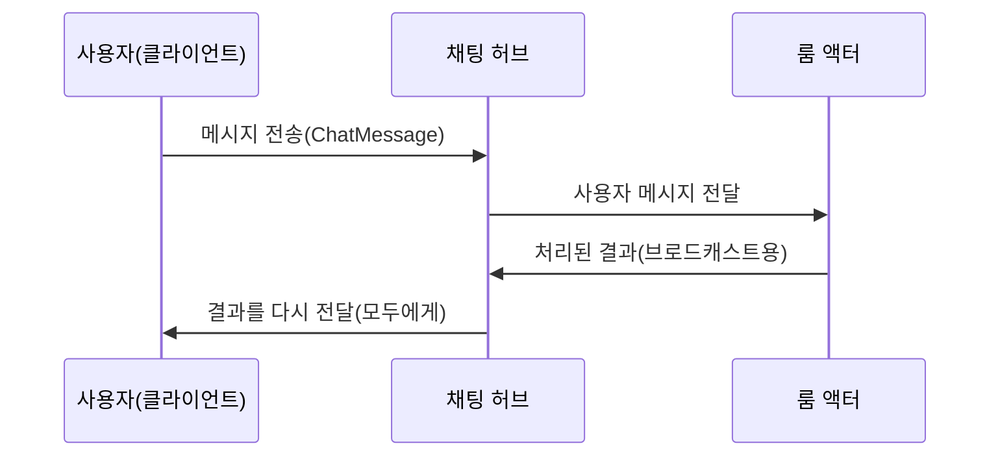

# Chapter 8: 채팅 허브

이전 장인 [애니메이션 컨트롤러](07_애니메이션_컨트롤러_.md)에서 우리는 캐릭터가 다양한 상태로 애니메이션을 자연스럽게 전환하는 방식을 배웠습니다. 이제는 여러 사용자가 동시에 접속해 메시지를 주고받고, 그에 따라 캐릭터도 물 흐르듯 움직일 수 있도록 “채팅 허브”를 살펴보겠습니다.

“채팅 허브”는 SignalR을 통해 클라이언트(브라우저나 앱)와 서버 사이에서 실시간 양방향 통신을 중개해 주는 핵심 구조입니다. 사용자가 채팅을 보내면, 채팅 허브가 이를 받아 [룸 액터](09_룸_액터_.md)에 전달하고, 룸 액터는 다른 모든 사용자에게 결과(메시지, 위치 정보 등)를 한꺼번에 뿌려 줍니다. 이 덕분에 여러 사람이 동시에 접속해 함께 대화하고, 각 캐릭터 상태가 실시간으로 동기화될 수 있습니다.

---

## 채팅 허브란?

- SignalR에서 제공하는 “Hub” 클래스를 상속받아 구현  
- 여러 클라이언트가 보내는 메시지를 받아 서버 측 로직(룸 액터)에 전달  
- 룸 액터가 처리한 결과를 다시 허브를 통해 모든 클라이언트에 전송(실시간 브로드캐스트)  

즉, “채팅 허브”는 신호가 들어오고 나가는 “채널” 같은 역할을 담당하며, 어려운 네트워크 작업 없이도 손쉽게 실시간 기능을 구현할 수 있게 해 줍니다.

---

## 왜 필요한가?

1. 여러 사용자가 동시에 메시지를 주고받기 위해 (멀티 채팅).  
2. 사용자의 움직임(위치 정보)도 실시간으로 공유할 수 있어야 함.  
3. 각 클라이언트가 수시로 접속/해제되어도 쉽게 처리할 수 있는 구조가 필요함.  

예를 들어, A와 B가 동시에 캐릭터를 움직이고, C가 채팅 메시지를 보내면, “채팅 허브”는 이 모든 데이터를 모아서 서버(룸 액터)에 넘기고, 처리된 결과(채팅, 위치)를 다시 A, B, C 모두에게 재빠르게 전달합니다.

---

## 기본 구조 한눈에 보기

아래 시퀀스 다이어그램은 “사용자 → 채팅 허브 → 룸 액터 → 채팅 허브 → 다른 사용자” 순으로 메시지가 흐르는 과정을 단순화해 보여줍니다.



1. 사용자가 허브에 “ChatMessage” 같은 메시지를 보냄  
2. 채팅 허브(H)가 룸 액터(RA)에 메시지를 넘김  
3. 룸 액터가 처리 후 다시 허브(H)에 “뿌려야 할 데이터”를 보내줌  
4. 허브는 모든 사용자(U)에게 결과를 브로드캐스트  

---

## 간단 코드 예시

프로젝트 내부 “BlazorChatApp\Server\Hubs\ChatHub.cs”에 구현된 채팅 허브는 대략 아래 형태를 가집니다(핵심 부분만 추려 10줄 이하로 간소화).

```csharp
public class ChatHub : Hub
{
    private readonly ActorSelection _roomActor;

    public ChatHub(ActorSystem actorSystem)
    {
        _roomActor = actorSystem.ActorSelection("user/room1");
    }

    public Task ChatMessage(ChatMessage message)
    {
        _roomActor.Tell(message);
        return Task.CompletedTask;
    }
}
```

- “ChatHub” 클래스가 SignalR의 “Hub”를 상속받음  
- 생성자에서 “ActorSystem”으로부터 룸 액터(`"user/room1"`)를 가져옴  
- “ChatMessage” 메서드로 들어온 메시지를 “_roomActor.Tell(...)”로 룸 액터에 전달  

따라서 클라이언트(브라우저)에서 “ChatMessage”를 호출하면, 서버 측 허브가 룸 액터에게 넘기게 됩니다.

---

## 연결 종료 처리

사용자가 브라우저를 닫거나, 네트워크가 끊겨 연결이 끊어지는 일도 잦습니다. 아래처럼 `OnDisconnectedAsync` 메서드를 통해 “Disconnect” 정보를 룸 액터에 보내, 내부적으로 유저 목록에서 제거할 수 있습니다.

```csharp
public override Task OnDisconnectedAsync(Exception ex)
{
    _roomActor.Tell(new Disconnect { ConnectionId = Context.ConnectionId });
    return Task.CompletedTask;
}
```

- “ConnectionId”를 통해 어떤 사용자가 끊겼는지 식별  
- 룸 액터가 이 정보를 받아 해당 사용자를 제외하고, 남은 사람들에게 알림  

---

## 클라이언트에서 메서드 호출하기

클라이언트(예: Blazor, JavaScript, 다른 C# 애플리케이션 등)에서 채팅 허브의 메서드를 부를 때는 보통 SignalR 클라이언트 라이브러리를 이용합니다. 예를 들어, JavaScript에서 다음처럼 호출할 수 있습니다:

```js
// JavaScript 예시 (설명용)
connection.invoke("ChatMessage", {
  user: "Kim",
  text: "안녕하세요!"
});
```

이 메시지는 곧바로 “ChatHub.ChatMessage” 메서드로 전달되고, 서버 측에서 룸 액터를 통해 처리된 뒤, 필요한 경우 다시 클라이언트들에게 방송됩니다.

---

## 자세한 내부 흐름

1) 클라이언트 쪽에서 `connection.invoke(...)`로 “ChatMessage”, “UpdateUserPos” 등 메서드를 호출.  
2) 채팅 허브가 동일한 이름의 C# 메서드(예: `public Task ChatMessage(...)`)를 찾아 실행.  
3) 허브 메서드는 룸 액터에게 메시지를 전달(`Tell(...)`).  
4) 룸 액터가 비즈니스 로직(채팅 저장, 위치 갱신 등)을 수행한 뒤, SignalR을 통해 모든 사용자에게 결과 전송.  
5) 이렇게 해서 각각의 UI가 최신 상태를 실시간으로 반영.

---

## 허브와 룸 액터의 관계

- 허브는 단순히 “받아서 보내는” 게 역할의 전부이며, 핵심 로직은 룸 액터가 담당  
- 허브가 “네트워크 진입점”, 룸 액터가 “실제 처리를 담당하는 배우”라고 보면 됨  
- 확장 시에는 여러 허브를 만들 수도 있지만, 동일한 룸 액터를 공유할 수도 있음  

이를 통해 앱 로직을 깔끔하게 분리할 수 있어, 네트워크 처리(허브)와 실질적 동시성 로직(룸 액터)을 독립적으로 수정, 확장하기 쉽습니다.

---

## 사용 시 주의사항

1. 허브 메서드는 반드시 “public”이어야 하며, Task나 void 반환 가능  
2. 클라이언트와 서버 메서드 이름이 정확히 일치해야 함(대소문자도 주의)  
3. 연결이 끊길 수 있으므로 `OnDisconnectedAsync` 등을 통해 예외 처리 또는 정리 로직을 둬야 함  
4. 동시에 여러 메시지가 들어올 수 있으므로, 액터(룸 액터) 쪽에서 동시성 처리를 담당  

---

### 예시 시나리오: 여러 사용자의 이동 동기화

1. A, B, C가 접속하여 각자 캐릭터를 움직임  
2. A의 브라우저에서 “UpdateUserPos”를 여러 번 호출  
3. 허브가 매 호출마다 “_roomActor.Tell(updateUserPos)”로 룸 액터에 전달  
4. 룸 액터가 “다른 사람들에게도 A 좌표 변경 알림을 보내야겠다”고 판단  
5. 룸 액터가 허브를 통해 브로드캐스트(A, B, C 모두에게 새 위치 전달)  
6. A, B, C 화면에서 A의 캐릭터가 동시에 움직이는 모습 확인  

이렇듯, 실시간 업데이트가 필요한 멀티플레이 상황에서 “채팅 허브”는 빠져서는 안 될 통신 접점입니다.

---

## 마무리 및 다음 장

이 장에서는 SignalR 기반의 “채팅 허브”가 클라이언트와 서버 사이를 어떻게 이어 주고, [룸 액터](09_룸_액터_.md)와 협력해 메시지를 실시간으로 방송하는지 알아보았습니다.  
- 허브는 네트워크 입구로서 메시지를 받고, 룸 액터에 전달  
- 클라이언트들은 허브 메서드를 호출하거나, 허브 수신 메서드를 통해 이벤트를 받아 UI 갱신  
- 여러 사용자가 동시에 접속해도 빠르고 일관된 상태 동기화 가능  

다음 장인 [룸 액터](09_룸_액터_.md)에서는 허브로부터 받은 메시지를 어떻게 처리하고, 동시에 방(룸) 안의 모든 사용자에게 결과를 전달하는지 좀 더 구체적으로 살펴보겠습니다.  

---

Generated by [AI Codebase Knowledge Builder](https://github.com/The-Pocket/Tutorial-Codebase-Knowledge)