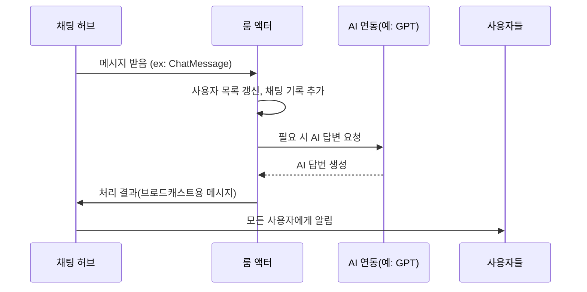

# Chapter 9: 룸 액터

이전 장인 [채팅 허브](08_채팅_허브_.md)에서 여러 클라이언트가 보낸 채팅 및 상태 정보를 서버로 전달하고, 다시 이를 모든 사용자에게 실시간으로 방송하는 구조를 살펴보았습니다. 이번 장에서는 그 정보들을 실제로 받아 처리하고, ‘중앙 제어탑’ 역할을 수행하는 “룸 액터”에 대해 알아봅니다. “룸 액터”는 Akka.NET을 활용해 채팅방(룸)의 모든 상태를 종합 관리하며, 메시지나 AI 답변, 봇 움직임 등을 유기적으로 연결해줍니다.

---

## 왜 “룸 액터”가 필요한가?

• 여러 사용자의 접속·퇴장, 위치 동기화, 채팅 기록 등을 한곳에서 제어해야 함.  
• “채팅 허브” 같은 네트워크 입구가 메시지를 받아도, 실제 비즈니스 로직(누가 어디로 움직였고, 어떤 답변을 AI가 해야 하나?)을 처리하려면 별도의 ‘실행 엔진’이 필요함.  
• Akka.NET 액터 모델을 이용하면, 동시성(Concurrency)에 강한 구조를 쉽게 설계할 수 있어, 다수 사용자가 동시에 메시지를 보내도 안전하게 처리 가능.

예를 들어, A, B, C 사용자가 “한 채팅방”에 동시에 접속한다면, “룸 액터”는  
1) 사용자 목록을 기록하고,  
2) 각 사용자가 보낸 메시지나 이동 정보를 받아,  
3) 필요한 사람(또는 봇)에게 ‘이동하라’, ‘AI 답변을 생성하라’ 같은 명령을 수행시키고,  
4) 결과를 다시 모두에게 알려주는 역할을 합니다.

---

## 핵심 개념 미리 살펴보기

1. 메시지 큐(Message 수신 처리)  
   - 액터는 “Tell(…)" 또는 “Send(…)" 형태로 메시지를 받습니다.  
   - 들어온 메시지 내용을 분석해, 해당 메시지를 어떻게 처리할지 결정합니다.

2. 사용자 상태(User State) 관리  
   - 누가 접속했는지, 어느 위치에 있는지, 어떤 이름을 사용하는지 등을 내부에 저장합니다.  
   - 접속 해제 시에는 목록에서 제거하고, 모두에게 알릴 수도 있습니다.

3. 봇(Bot) 액션  
   - 룸 액터는 봇 계정(또는 AI 답변)을 트리거할 수 있습니다.  
   - 예: “챗GPT에게 답장 생성” → 봇 메시지 생성 → 다시 전체에 브로드캐스트.

4. Chat History  
   - 간단한 경우, “최근 50개 채팅” 같은 형식으로 기록을 관리해, 새로 들어온 사용자에게도 방금 전에 오간 대화를 보여줄 수 있습니다.

---

## 전체 동작 예시 한눈에 보기

아래 시퀀스 다이어그램은 “룸 액터”가 어떻게 메시지를 받고 처리하여 결과를 뿌리는지 단순화해 표현합니다.



1) 채팅 허브(Hub)에서 “ChatMessage”를 룸 액터(RA)로 전달  
2) 룸 액터는 내부 상태(사용자 목록, 채팅 기록 등)를 갱신  
3) AI가 필요하다면 GPT와 연동 후 결과를 받음  
4) 최종적으로 룸 액터가 허브(H)에 “모든 사용자에게 뿌려 달라”고 결과를 넘김  
5) 허브가 이를 “U(사용자들)”에게 방송

---

## 어떻게 사용하는가?

1) 서버 쪽에서 “룸 액터”를 생성해 둡니다(예: “room1” 액터).  
2) “채팅 허브”는 사용자의 메시지를 받으면, 메시지를 “room1” 액터에게 “Tell(…)" 형태로 전달합니다.  
3) 룸 액터는 메시지 종류(“JoinRoom”, “UpdateUserPos”, “ChatMessage” 등)를 분기 처리하여 내부 작업을 수행합니다.  
4) 처리 결과가 준비되면 룸 액터는 다시 “허브”로 “OnUpdateUserPos”, “OnChatMessage” 등 호출을 부탁해, 모든 사용자에게 브로드캐스트합니다.

---

## 코드 예시 (간단화)

아래 코드는 “RoomActor” 클래스에서 “ChatMessage”를 받았을 때 처리하는 초간단 로직입니다(10줄 이하로 축약되었습니다).

```csharp
public class RoomActor : ReceiveActor
{
    public RoomActor()
    {
        // 메시지 종류에 따라 처리
        Receive<ChatMessage>(msg =>
        {
            // 1) 채팅 기록에 추가
            // 2) AI 연동(필요 시)
            // 3) 모든 사용자에게 브로드캐스트(채팅 허브 통해)
        });
    }
}
```

- “Receive<ChatMessage>”로 채팅 메시지가 들어오면, 그 안의 내용을 바탕으로 필요한 작업을 수행합니다.  
- (예시에서는 주석으로 처리했지만, 실제 구현에서는 “chatHistory”에 저장하고, AI가 필요하면 OpenAI API 호출 뒤 결과를 생성합니다.)

이처럼 “룸 액터”는 “Receive<T>” 블록으로 메시지 타입별 행동을 정의합니다.

---

## 사용자 접속/퇴장 로직 예시

조금 다른 메시지 형태인 “JoinRoom”, “LeaveRoom” 등을 처리할 때도 마찬가지입니다.

```csharp
Receive<JoinRoom>(cmd =>
{
    // (1) 사용자 정보 목록에 추가
    // (2) 브로드캐스트 "OnJoinRoom"
});

Receive<LeaveRoom>(cmd =>
{
    // (1) 목록에서 제거
    // (2) 브로드캐스트 "OnLeaveRoom"
});
```

각 Receive 블록은 해당 메시지가 들어왔을 때 어떤 로직을 실행할지 완결성 있게 정의하고 있습니다.

---

## 내부 구현: 단계별 처리

룸 액터 내부에서 메시지를 처리하는 과정을 좀 더 구체적으로 살펴봅시다:

1) 액터가 메시지를 받으면, 메시지 타입을 체크  
2) “JoinRoom”이면 사용자 목록(Dictionary)에 새로 추가 → “모두에게” 접속 공지 메서드 호출  
3) “ChatMessage”이면 채팅 기록 큐에 쌓고, AI가 필요하면 호출 → 결과와 함께 “모두에게” 채팅 전송  
4) “UpdateUserPos”면 사용자 좌표 갱신 후, “모두에게” 위치 변경 사항 알림  
5) 기타 “Tick” 같은 봇 움직임용 메시지도 처리해 필요 시 봇 캐릭터를 이동  

이 모든 과정을 단일 “RoomActor” 안에서 제어하기에, 룸 액터가 일종의 “중앙 감독관” 역할을 하게 됩니다.

---

## 소규모 코드 스니펫: 사용자 위치 갱신

아래는 “UpdateUserPos” 메시지를 처리하는 예시입니다(설명용, 9줄 이내).

```csharp
Receive<UpdateUserPos>(async pos =>
{
    // 1) 내부 users 딕셔너리에 해당 사용자 좌표 저장
    // 2) 브로드캐스트( OnUpdateUserPos )로 모든 사용자가 알 수 있도록
});
```

- 실제로는 “pos.PosX, pos.PosY” 정보를 누적하는 로직이 들어가고,  
- 완료 후에는 허브(Context)를 통해 전체 클라이언트에게 “누가 어디로 이동했다”는 이벤트를 전송합니다.

---

## AI 연동과 봇 자동 동작

룸 액터에는 ChatGPT(또는 OpenAI API)처럼 외부 AI를 연결해, 특정 메시지가 오면 AI 답변을 생성하도록 만들 수도 있습니다. 또는 “Tick” 메시지를 주기적으로 스케줄링해 봇 캐릭터가 자동으로 움직이게도 할 수 있습니다.

이 모든 로직이 “룸 액터” 안에 모여 있으면 편리합니다. 왜냐하면, “부정확한 동시 접근”이나 “메시지 중복 처리” 같은 문제를 액터 모델이 자연스럽게 막아주기 때문입니다.

---

## 전체 요약

- “룸 액터”는 한 채팅방의 모든 정보를 관리하는 **중앙 제어탑**  
- 채팅 허브로부터 메시지를 받고, 사용자 목록이나 채팅 기록을 업데이트한 뒤, 필요한 이벤트를 다시 허브로 전달해 브로드캐스트  
- AI 연동, 봇 제어 등 확장 기능을 여기에 붙여서, 모든 사용자에게 일관성 있게 서비스를 제공  

---

## 다음 장 예고

이번 장에서는 룸 액터가 여러 메시지를 받아 각종 비즈니스 로직을 담당하고, 결과를 다시 사용자들에게 전달하는 구조를 살펴보았습니다. 정리하자면, “채팅 허브”가 네트워크 입구라면, “룸 액터”는 내부에서 핵심 동작을 책임지는 엔진입니다.

다음 장인 [채팅 메시지 모델](10_채팅_메시지_모델_.md)에서는 이 모든 흐름 속에서 실제로 오가는 “채팅 메시지” 모델이 어떤 식으로 구성되고, 어떤 속성들이 있는지 자세히 살펴보겠습니다. 기대해 주세요!

---

Generated by [AI Codebase Knowledge Builder](https://github.com/The-Pocket/Tutorial-Codebase-Knowledge)