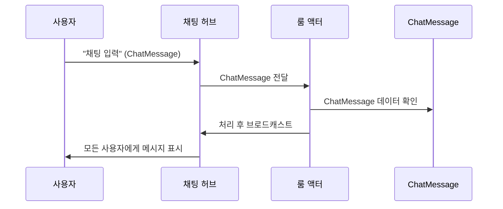

# Chapter 10: 채팅 메시지 모델

이전 장인 [룸 액터](09_룸_액터_.md)에서 룸 액터가 어떻게 여러 사용자의 메시지를 받아 처리하고, 최종적으로 결과를 모든 클라이언트에게 뿌려주는지 살펴보았습니다. 이번 장에서는 그 과정에서 오가는 핵심 데이터 구조인 “채팅 메시지 모델”을 알아보겠습니다. “채팅 메시지 모델”은 누가 보낸 메시지인지, 메시지를 화면에 표시할지 말지 등을 담아, 사용자 간의 대화를 체계적으로 전달해 줍니다.

---

## 왜 “채팅 메시지 모델”이 필요한가?

가령 온라인 채팅방을 생각해 보세요. 한 사용자가 “안녕하세요!”라고 입력하면, 서버에서는 다음과 같은 사항을 알아야 합니다:

1. 누가 이 메시지를 보냈는가? (사용자 정보)  
2. 실제 채팅 내용은 무엇인가? (문자열)  
3. 이 메시지를 다른 사용자에게 보여줘야 하는지, 숨겨야 하는지 여부는?  

다양한 사용자와 서버가 동시에 메시지를 주고받을 때, 이 정보들을 일관된 형태로 전달해야 혼동이 일어나지 않습니다. 바로 이럴 때 “채팅 메시지 모델”이라는 클래스에 데이터를 깔끔히 담아, 네트워크를 통해 주고받도록 설계하는 것입니다.

---

## 기본 구조 살펴보기

프로젝트에서는 “ChatMessage”라는 클래스를 사용해 채팅 메시지를 정의합니다. 아래처럼 매우 간단한 형태로 구성되어 있어요.

```csharp
public class ChatMessage
{
    public UserInfo From { get; set; }    // 누가 보냈는지
    public string Message { get; set; }   // 실제 텍스트
    public bool IsVisible { get; set; } = true; // 출력 여부
}
```

- UserInfo From: 메시지를 보낸 사용자 정보(예: ID, Name 등)를 담습니다.  
- string Message: 실제 메시지 내용입니다.  
- bool IsVisible: 메시지를 화면에 표시할지 제어하는 플래그입니다. 기본값으로 true가 설정됩니다.

이 구조 덕분에 서버와 클라이언트가 서로 동일한 클래스를 공유하며, 직렬화/역직렬화를 통해 정확히 같은 정보를 주고받을 수 있습니다.

---

## 예시 시나리오: 메시지 전송 과정

사용자가 “안녕하세요!”라고 입력할 때 어떤 흐름을 거치는지, 간단히 시퀀스 다이어그램으로 살펴보겠습니다.



1. 사용자가 “chatMessage”를 생성해 허브(H)에 보냅니다.  
2. 허브는 이 메시지를 룸 액터(RA)에 전달합니다.  
3. 룸 액터가 메시지를 확인해 필요 시 가공하거나 AI 답변을 생성(이전 장 내용)할 수도 있습니다.  
4. 최종적으로 룸 액터는 “보내야 할 메시지”를 다시 허브로 넘기고, 허브는 모든 사용자 클라이언트에게 브로드캐스트합니다.  
5. 각 사용자 화면에서 동일한 ChatMessage(From, Message, IsVisible)를 확인할 수 있습니다.

---

## 내부 속성별 활용 예시

1. From (UserInfo)  
   - 메시지를 보낸 사람의 ID나 이름, 역할(Role) 등을 함께 담을 수 있어, 클라이언트 측에서 “어떤 닉네임이 보낸 메시지인지” 쉽게 표시할 수 있습니다.  

2. Message  
   - 채팅 내용. 예: “안녕하세요!”  
   - 이 값은 고객이 직접 입력한 텍스트이므로, 서버 또는 클라이언트 측에서 보안/필터링이 필요할 수도 있습니다.  

3. IsVisible  
   - 메시지를 화면에 출력하지 않고 싶은 경우(예: moderation) false로 설정할 수 있습니다.  
   - 애초에 공개 채팅이 아닌 어떤 특정 로직에서 숨긴 채 처리할 수도 있습니다.

---

## 코드 예시: 메시지 받아 표시하기

클라이언트 측(Blazor 예시)에서 메시지를 받고, List에 추가해 화면에 표시하는 간단 흐름을 봅시다.

```csharp
// 메시지 수신 시 실행되는 메서드 예시
private void OnReceiveChatMessage(ChatMessage msg)
{
    if (!msg.IsVisible) return; // 표시 안 하는 경우는 넘어감

    _chatList.Add(msg); // 채팅 목록에 추가
    StateHasChanged();   // 화면 갱신
}
```

1) “OnReceiveChatMessage” 메서드는 서버(허브)에서 받은 ChatMessage를 인자로 받습니다.  
2) IsVisible이 false이면 표시하지 않고 빠져나갑니다.  
3) 그 외라면 _chatList에 메모리상 추가한 뒤, 화면 렌더링을 최신화합니다.

---

## 내부 구현: ChatMessage.cs

실제로는 [BlazorChatApp\Shared\ChatData.cs](#) 파일 내에 “ChatMessage” 클래스가 정의되어 있습니다(위 예시와 거의 동일). 꼭 필요한 필드만 두었고, 전송 시 직렬화가 쉽도록 기본 속성만 프로퍼티 형태로 노출해 둡니다.

아래는 그 구조를 다시 한 번 축약해 본 것입니다.

```csharp
public class ChatMessage
{
    public UserInfo From { get; set; }
    public string Message { get; set; }
    public bool IsVisible { get; set; } = true;
}
```

- 특별한 로직 없이 데이터 담는 용도로만 사용됩니다.  
- 룸 액터나 허브에서 이 클래스의 인스턴스를 만들거나 가공해 넘겨주면, 클라이언트들은 동일한 속성을 그대로 활용합니다.

---

## 확장 아이디어

채팅 메시지에 “Timestamp(보낸 시각)”나 “MessageType(일반 텍스트, 동작 알림 등)” 같은 속성을 더 붙일 수도 있습니다. 예를 들어, 시스템 공지 메시지에는 IsVisible과 별개로 다른 UI를 적용해야 할 때, “Type=System” 같은 속성을 추가해 분기 처리할 수 있죠.

---

## 요약 및 마무리

정리하자면, “채팅 메시지 모델(ChatMessage)”은:

- 누가 보낸 메시지인지(From),  
- 어떤 텍스트를 담고 있는지(Message),  
- 공개 여부(IsVisible)는 어떠한지  

를 한눈에 확인할 수 있도록 구조화해 둔 데이터 클래스입니다. 덕분에 서버·클라이언트가 같은 데이터를 공유하고, 여러 사용자가 동시에 접속하는 상황에서도 메시지 흐름이 뒤섞이지 않게 됩니다.

이로써 “BlazorChatAppEcom” 프로젝트에서 다룰 핵심 구조들을 모두 살펴보았습니다. 이제 여러분은 씬 그래프, 캐릭터, 입력 시스템, 채팅 허브, 룸 액터, 그리고 채팅 메시지 모델까지 전반적인 동작 원리를 이해하셨을 것입니다. 앞으로 직접 코드를 수정하거나 확장할 때, 이 개념들을 적절히 활용하여 원하는 기능을 추가해 보세요.  
모두 수고하셨습니다!  

---

Generated by [AI Codebase Knowledge Builder](https://github.com/The-Pocket/Tutorial-Codebase-Knowledge)