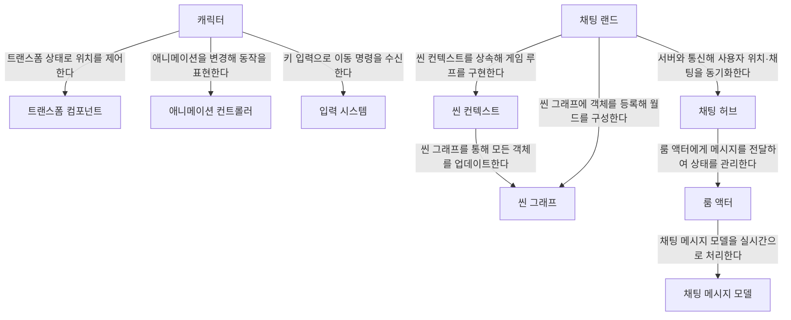

# Tutorial: BlazorChatAppEcom

**이 프로젝트**는 Blazor와 SignalR을 활용해 실시간 *채팅*과 간단한 게임 월드를 구현한 예시입니다.  
여러 사용자가 **가상 공간**에서 캐릭터로 움직이고 대화를 나누며,  
*움직임*과 *메시지*가 서버를 통해 모두에게 공유되는 모습을 보여줍니다.

**Source Repository:** [BlazorChatAppEcom](https://github.com/psmon/BlazorChatAppEcom)

## Chapters

1. [채팅 랜드
](01_채팅_랜드_.md)
2. [씬 컨텍스트
](02_씬_컨텍스트_.md)
3. [씬 그래프
](03_씬_그래프_.md)
4. [캐릭터
](04_캐릭터_.md)
5. [입력 시스템
](05_입력_시스템_.md)
6. [트랜스폼 컴포넌트
](06_트랜스폼_컴포넌트_.md)
7. [애니메이션 컨트롤러
](07_애니메이션_컨트롤러_.md)
8. [채팅 허브
](08_채팅_허브_.md)
9. [룸 액터
](09_룸_액터_.md)
10. [채팅 메시지 모델
](10_채팅_메시지_모델_.md)

---

Generated by [AI Codebase Knowledge Builder](https://github.com/The-Pocket/Tutorial-Codebase-Knowledge)
